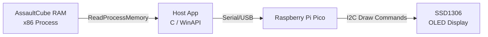

# AssaultCube Telemetry Tracker

A real-time hardware telemetry system that reads live game state from AssaultCube via the Windows API, then transmits it over serial to a Raspberry Pi Pico microcontroller driving physical displays.
Written in C using the Windows API and the Pico SDK, parses dynamic pointer chains to extract live game state and transmits it over USB to be displayed on an OLED.
The host application is strictly read-only and written for AssaultCube version 1.3.0.2.
Built as a personal project to learn reverse engineering, Windows process internals, embedded systems and serial communication.


## How It Works



## Build Modes

The application behavior is controlled via `#define BUILD_MODE` in [`config/config.h`](config/config.h):

* **`E2E` (End-to-End, Default):** Host app reads game memory and sends CSV data over COM port, Pico parses packets and renders live stats on the SSD1306 OLED screen.
* **`PICO_ECHO`:** Hardware testing mode. Host app sends telemetry to the Pico, and the Pico echoes parsed stats back to the PC over USB serial for verification.
* **`CONSOLE`:** Host-only debugging mode. Host app reads memory and prints formatted telemetry directly to the PC terminal without requiring COM port access.

## Getting Started
All setup documentation can be found in the [`docs/`](docs/) directory:
* **[Setup & Installation Guide](docs/setup.md):** Step-by-step instructions on cloning the repo, compiling the host application and firmware, and running the telemetry tracker.
* **[Hardware & Wiring](docs/hardware.md):** The physical schematic, pinout tables, and a parts list for the hardware needed.

## Repo structure

```
./
├── src/
│   ├── main.c              # Entry point for the host application
│   ├── memory/             # Windows process memory API and offsets
│   └── telemetry/          # Windows serial telemetry transmission
├── config/
│   └── config.h             # Header that defines project wide macros
├── firmware/                   
│   └── telemetry_display/  # Includes data parsing, serial communication and display driver
├── docs/                   # Documents that follow the development of this project
└── VG_Telemetry.sln       # Visual Studio solution to build
```

## Limitations and Possible Improvements

* **Architecture:** Since USB has no Direct Memory Access to the computer's RAM, this project was not possible to do in a strictly "external" manner.
* **Version:** All memory offsets are hardcoded specifically for AssaultCube v1.3.0.2 (32-bit).
* **OS:** As the project  was built using the Window's API, it only works natively on Windows.
* **COM Port Handling:** The serial communication requires manual COM port selection. Implementing auto-detection and hot-plug reconnection would improve this.
* **OLED Display set:** The SSD1306 driver uses a minimal 8x8 ASCII font array. Special symbols (such as `:`, `/`, or icons) are not available, limiting graphical formatting. This can also be improved.
* **Caching**: Caching could be implemented to prevent unnecessary operations such as sending game state when no values have actually been updated in game since the last tick.
* **Threading**: Altough not a real issue as of right now, Multithreading could be employed to delegate different tasks to diffent threads
* **Clipping**: There are some issues with text being clipped out of bounds in the display.


<p align="center">
  <i>Third live telemetry test — struct populated and then formatted with the telemetry functions</i>
</p>


https://github.com/user-attachments/assets/1b1096cb-afb0-4ecd-b5f1-cdabee5d1925


> [!NOTE]
> This project is developed for academic purposes only. AssaultCube is an open-source game, no proprietary software is modified or redistributed.
