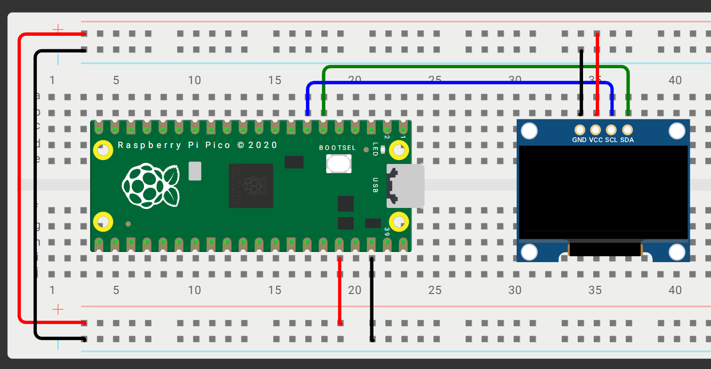

# Hardware Setup & Wiring

## Hardware List
Here are the exact components used for this build:
* [Raspberry Pi Pico](https://mauser.pt/096-9421/raspberry-pi-sc0915-microcontrolador-raspberry-pi-pico)
* [SSD1306 OLED Display](https://mauser.pt/096-8736/display-oled-0-91-128x32-ssd1306-branco)
* [Breadboard](https://electropeak.com/bread-board-10-55-165mm)
* [Jumper Wires](https://mauser.pt/096-7941/conjunto-de-40-cabos-de-ligacao-jumper-dupont-macho-femea-150mm)

## Wiring & Pin Assignments
Connect the OLED display to the Raspberry Pi Pico using the following pins:

| Pi Pico Pin | SSD1306 OLED |
| :--- | :--- |
| Pin 6 (GP4) | SDA |
| Pin 7 (GP5) | SCL |
| Pin 36 (3V3 OUT) | VCC |
| Pin 38 (GND) | GND |

> **Note:** The Pico runs on 3.3V. Connect the OLED VCC to the `3V3 OUT` pin (Pin 36), not the 5V VBUS pin

## Schematic

## Reference Datasheets
* [Raspberry Pi Pico Pinout (PDF)](https://pip-assets.raspberrypi.com/categories/610-raspberry-pi-pico/documents/RP-008309-DS-1-Pico-R3-A4-Pinout.pdf)
* [SSD1306 Datasheet & Info](https://www.datasheethub.com/ssd1306-128x64-mono-0-96-inch-i2c-oled-display/) — Note: this page documents the 128x64 variant; this project uses the 128x32 model but the command interface is identical.

## Development References

* [Raspberry Pi Pico SSD1306 Example](https://github.com/raspberrypi/pico-examples/tree/master/i2c/ssd1306_i2c) - I ported the initialisation sequence and the `WriteString`/`WriteChar` functions from this example.
* [daschr/pico-ssd1306](https://github.com/daschr/pico-ssd1306/tree/main) - An alternative lightweight library that serves as a good educational reference for structuring an OLED driver.
* [Pico SDK Runtime API](https://www.raspberrypi.com/documentation/pico-sdk/runtime.html) - Documentation for the SDK's C runtime.
* [Pico SDK source code](https://github.com/raspberrypi/pico-sdk) - Source files for Pico SDK.
